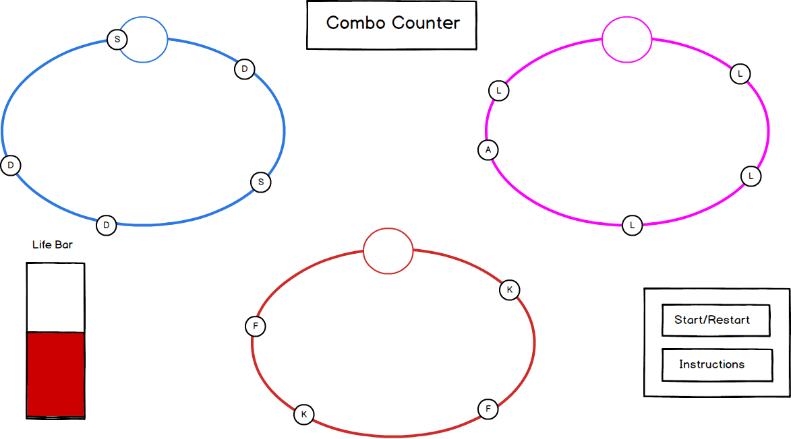

## Typing Multitasker

### Background

Typing Multitasker is a typing game that utilizes rhythm, timing, and multi-tasking inspired by  **Gyroshi**. A single player game that plays out on three circles which rotate with a pair of letters. Once the letter reaches the top of the circle, the user will need to hit the correct key in order to raise their life bar. The game starts off with one circle of rotating letters, but as the game progresses other circles will  appear and rotating their own letters. In additional to more circles appearing, the speed at which the letters revolve around the circle will also increase.

### Functionality & MVP  

- [ ] Click on Letter inside circle and obtain feedback(sound/animation) if hit correctly.
- [ ] Letters will rotate inside the circle and disappear after one rotation.
- [ ] A combo meter to show how many letters that are hit in a row.
- [ ] Life bar that will end the game if a certain number of incorrect keys are hit.
- [ ] Start and Restart button for when the player loses
- [ ] A production Readme

### Wireframes

This app will consist of a single screen with game board, game controls, and nav links to the Github, my LinkedIn, and the About modal.  Game controls will include any letter on the keyboard.

### Architecture and Technologies

This project will be implemented with the following technologies:

- Vanilla JavaScript - For the game logic, ie switch statements for when correct/incorrect keys are pressed/
- HTML5 Canvas & easel - for creating animations, backgrounds, and rendering shapes
- Webpack - to bundle up all the code and allow for import/export
- Babel - for compiling javascript.
- yuki-createjs - to allow easal to work with webpack bundler

In addition to the webpack entry file, there will be three scripts involved in this project:

`canvas.js`: this script will handle the logic

`circle.js`: will generate the circle and animations

### Implementation Timeline

**Day 1**: Setup files, babel, webpack, canvas, and easel.js. Create a factory function to generate moving letters that will appear after a set interval. Create a switch function to manage the event listener for key strokes.

**Day 2**: Create and handle the game logic for one circle so that when the letter is within 50pixels of the input circle that a correct response is returned.

**Day 3**: Add more letters into the circle so that a constant stream of letters will appear within a circle.

**Day 4**: Style the frontend, add different colors to the circles. Add some fade or movement as

### Bonus features

- [ ] Animations/Sounds in the background when letters clicked correctly
- [ ] The input circle moves along the outer circle.
- [ ] The outer circles also start moving.
- [ ] Music for when certain combo lengths are reached.
