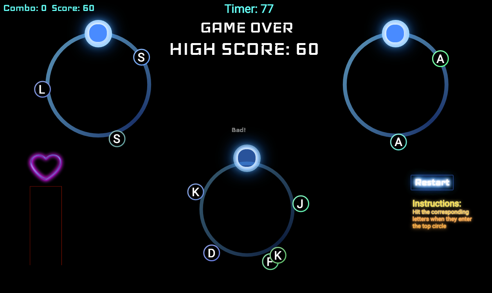

## Typing Multitasker

### Background


Typing Multitasker is a typing game that utilizes rhythm, timing, and multi-tasking inspired by  **Gyroshi**.

Live Site: [Typing-Multitasker-App](https://bvluong.github.io/Typing-Multitasker/)


## Technology

Typing Multitasker utilizes the following:

- Vanilla JavaScript - For the game logic and event handlers.
- HTML5 Canvas / Easeljs / Tweenjs - For creating animations, backgrounds, and rendering shapes.
- Webpack - To bundle up all the code and allow for import/export.
- Babel - For compiling javascript.
- yuki-createjs - To allow Easaljs to work with webpack bundler.

## Gameplay


Typing Multitasker is a single player game that is played with three circles which rotate a set of letters. Once the letter reaches the top of the circle, the user will need to hit the correct key in order to raise their life bar. The game starts off with one circle of rotating letters, but as the game progresses other circles will  appear and rotating their own letters.

```javascript
document.addEventListener("keydown", keyDownTextField, false);
function keyDownTextField(e) {
  const keyInput = e.key;
  if (newGame.inCircle(keyInput.toUpperCase())) {
      newGame.removeLetter();
      newGame.comboCount += 1;
      newGame.score += 1;
      newGame.increase_lifepoints();
  } else {
    newGame.lifeBar.scaleY += 0.04;
    newGame.lifepoints -= 40;
    newGame.comboCount = 0;
  }
}

```

## Features


- Combo counters will reward longer combos by revealing the background image
- Sound/Animation feedback for hitting the correct key and not hitting the key in time

## Snippets

```javascript
this.startLetters = setInterval(() => {
  this.start_time += this.random_intervals[0];
  if (Math.floor(Math.random()*this.frequency) < 4) {
    let letter = this.stage
      .addChild(createLetter(this.firstLetters[Math.floor(Math.random()*4)] ));
    this.letters_array.push({ letter, start_time: this.start_time });
  }
}, this.random_intervals[0]);
```
Letters are randomly generated and the frequency of the generation in based on a stored variable `frequency`. During set intervals of the game, the frequency will be changed to increase and decrease the difficulty. Letters are added to a `letters_array` to keep track and manipulate the canvas elements.

```javascript
animateCircle(bigCircle, smallCircle) {
  bigCircle.scaleX = 1.1;
  bigCircle.scaleY = 1.1;
  smallCircle.scaleX = 1.15;
  smallCircle.scaleY = 1.15;
  createjs.Tween.get(smallCircle).to({alpha: 1, scaleX: 1, scaleY: 1},700);
  createjs.Tween.get(bigCircle).to({alpha: 1, scaleX: 1, scaleY: 1},700);
}
```
Feedback animations are handled using **Tween.js** by controlling the scale of the objects and manipulating the opacity by changing the alpha parameter.

### Wireframe


### Bonus features

- [ ] Input circle will move along the outer circle.
- [ ] The outer circles will rotate and switch spots with other circles.
- [ ] Music and other reward systems for when certain combo lengths are reached.
